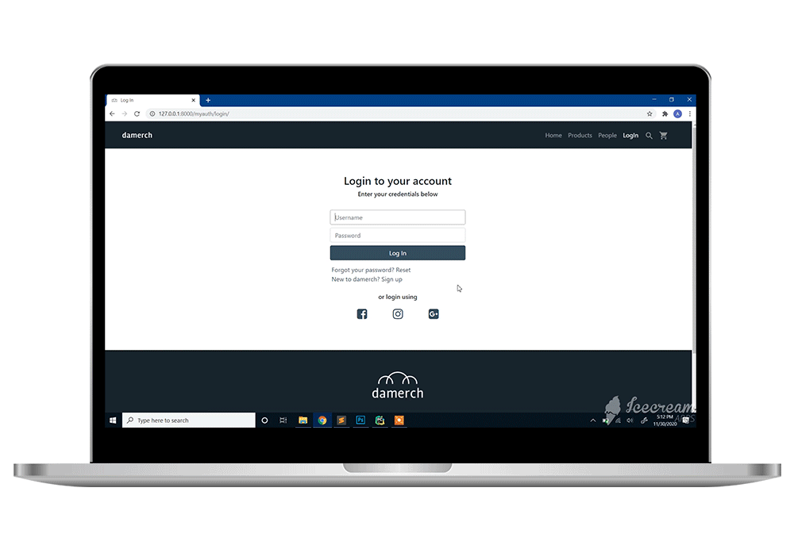
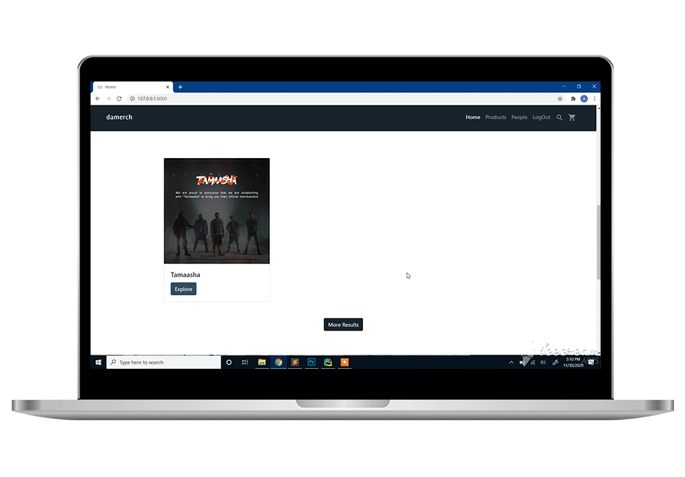
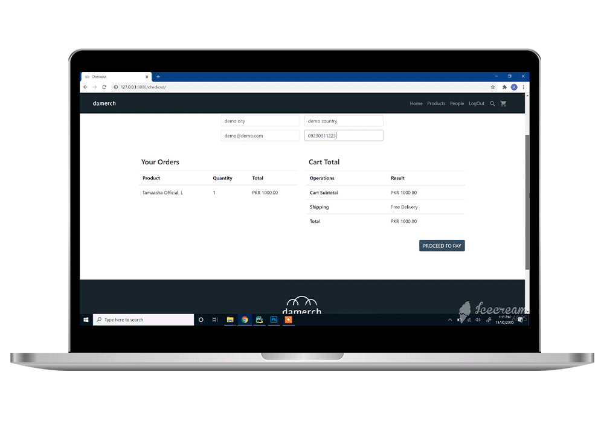

# Damerch - Ecommerce Platform

A full-fledged ecommerce platform built with Django, offering comprehensive features including authentication, shopping cart, checkout, and payment processing.

## Features

### User Experience

- User authentication with social logins
- Product catalog with detailed views
- People/Artist profiles
- Advanced product search
- User alerts and notifications
- Responsive design for all devices

### Shopping Features

- Shopping cart with real-time updates
- Secure checkout process
- Multiple payment methods including Cash on Delivery
- Order tracking and management
- Automatic email notifications

## Product Images

### Home Page

### Authentication

### Product Catalog

### People/Artists

### Shopping Cart

### Checkout Process

## Technical Stack

### Backend

- Django framework
- SQLite3 database
- Python-based templating
- Email integration with SendGrid

### Frontend

- Bootstrap for responsive design
- jQuery for interactive elements
- AJAX for asynchronous requests
- HTML5/CSS3

### Authentication

- Django authentication system
- Social auth integration using django-allauth

### Payment Processing

- Integrated payment gateway using Stripe
- Secure transaction handling
